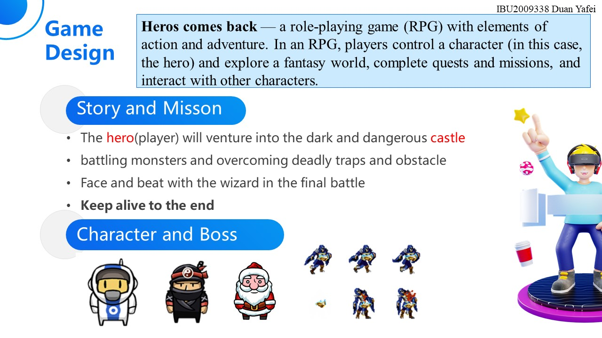
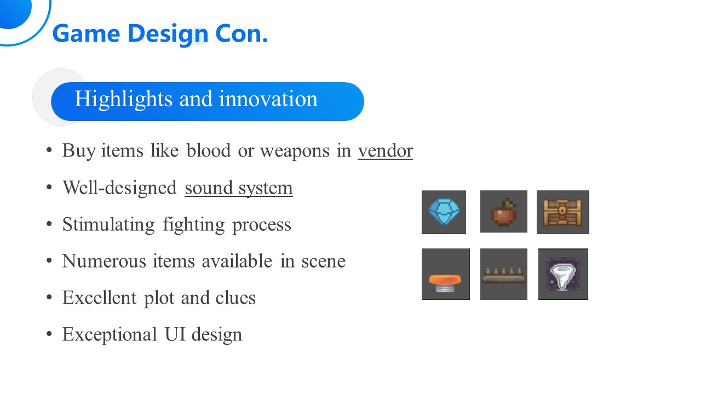
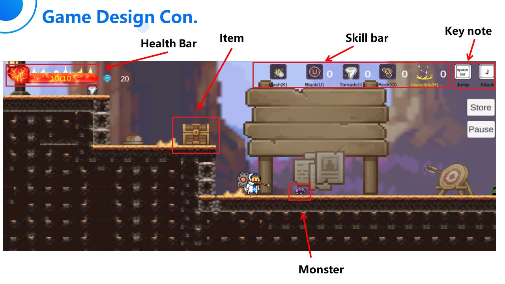
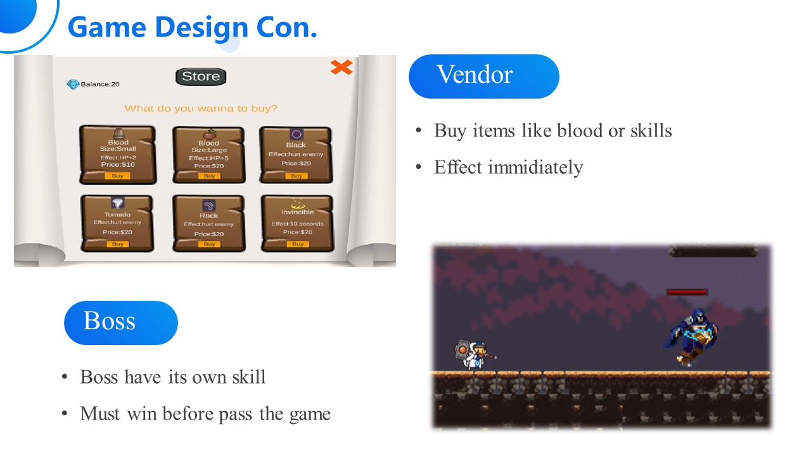

# Hero Comes Back v2

> 此项目是项目 [Hero Comes Back v2](https://github.com/Fab-Liu/Hero-Comes-Back-2D-Rogue-Like-Game)的变种, 二者的区别主要在于组件以及动画逻辑上面的一些尝试。

从前，在一个遥远的王国里，住着一位勇敢而高贵的英雄，他保护这片土地免受各种邪恶和危险的侵害。 多年来，这位英雄与无数敌人英勇作战，赢得了人们的钦佩和尊重。但是有一天，这位英雄遇到了他们最大的挑战：一位强大的巫师，对王国施了咒语，所到之处造成混乱和破坏 . 尽管他们尽了最大的努力，英雄还是无法打败巫师而被迫撤退。感到失败并不确定下一步该做什么，英雄退出了王国并隐居多年。 但随着巫师的力量越来越强，王国的人民开始失去希望终于，在漫长的岁月之后，英雄不能再无视人民的苦难，决定重返王国。 穿上旧盔甲，挥舞着可靠的剑，英雄再次挑战魔法师，恢复大地的和平。由此开始了“英雄归来”的故事，一个关于勇敢、救赎和与邪恶永无止境的战斗的故事 . 英雄能否克服过去的失败并击败魔法师，还是会再次堕落？ 王国的命运落在他们的肩上。

Once upon a time, in a kingdom far, far away, there lived a brave and noble hero whoprotected the land from all manner of evil and danger. For many years, the hero foughtvaliantly against countless foes, earning the admiration and respect of the people.But one day, the hero met their greatest challenge yet: a powerful sorcerer who had casta spell on the kingdom, causing chaos and destruction wherever they went. Despitetheir best efforts, the hero was unable to defeat the sorcerer and was forced to retreat.Feeling defeated and unsure of what to do next, the hero withdrew from the kingdomand lived in seclusion for many years. But as the sorcerer's power grew stronger, thepeople of the kingdom began to lose hope.XIAMEN UNIVERSITY MALAYSIAFinally, after many long years, the hero could no longer ignore the suffering of thepeople and decided to return to the kingdom. Donning their old armor and wieldingtheir trusty sword, the hero set out to challenge the sorcerer once again and restore peaceto the land.Thus begins the story of "Hero Comes Back," a tale of bravery, redemption, and thenever-ending battle against evil. Can the hero overcome their past failures and defeatthe sorcerer, or will they fall once again? The fate of the kingdom rests on theirshoulders.

## Game Screenshot

## Thanks
Give a star if you like this project. Thanks for your support.

给个星星如果你喜欢这个项目。感谢你的支持。

